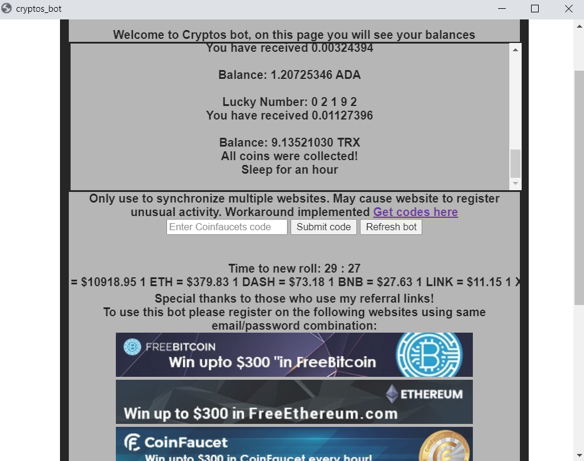

### Bot does not work anymore - CAPTCHA added by website owners !!!

### If you would like to implement tensorjs CAPTCHA solver, please feel free to try

## Table of Contents

* [About the Project](#about-the-project)
  * [Built With](#built-with)
* [Getting Started](#getting-started)
  * [Prerequisites](#prerequisites)
  * [Installation](#installation)
* [Usage](#usage)
* [Contributing](#contributing)
* [License](#license)
* [Contact](#contact)
* [Acknowledgements](#acknowledgements)


## About The Project

Cryptos Faucets is a newly established cryptocurrency faucet company which offers free cryptocurrency rolls every hour.

This script is developed to automate rolls on Cryptos Faucets websites given that all your accounts have same email address and password. Please review the code to make sure I am not storing your credentials in any way. The credentials are entered upon launching the bot and will be deleted when the bot is shut down.

The bot is performing quite well, but still needs to be improved for additional error handling and smarter behaviour to make sure rolls on each website are made every hour. Apart from that more security can be added to protect your credentials.

Please feel free to use, modify or improve this bot!

To support this project please register on Cryptos Faucets websites using my referral links and use the bot often. You can also share these links and the bot with other people:


TRX : https://free-tron.com/?ref=2879

ADA : https://freecardano.com/?ref=221297

BTC : https://freebitcoin.io/?ref=303045

ETH: https://freeethereum.com/?ref=27517

BNB : https://freebinancecoin.com/?ref=27615

XRP : https://coinfaucet.io/?ref=630522

DASH : https://freedash.io/?ref=7688

LINK : https://freechain.link/?ref=1166

DOGE: https://free-doge.com/?ref=21346


OR:

BTC : https://freebitcoin.io/?ref=376363

LTC : https://free-ltc.com/?ref=38234

ETH : https://freeethereum.com/?ref=107158

DASH : https://freedash.io/?ref=59475

BNB : https://freebinancecoin.com/?ref=77687

ADA : https://freecardano.com/?ref=253723

USDC : https://freeusdcoin.com/?ref=80753

USDT : https://freetether.com/?ref=119712

TRX : https://free-tron.com/?ref=111513

*Notice:* The USDC, USDT, STEAM and NEM faucets are not included. You can append the urls to these websites in [website file](config/websites.txt) file if you wish to automate the rolls for these as well.

### Built With
* [Node.js](https://nodejs.org/en/)
* [Puppeteer](https://github.com/puppeteer/puppeteer)
* [Chromium](https://www.chromium.org/)
* [Dotenv](https://github.com/motdotla/dotenv)


## Getting Started

To run this script you need to install Node.js. Once done, all dependencies will be installed by using [package.json](package.json)

### Prerequisites

Install Node.js:
https://nodejs.org/en/download/
* npm
```sh
npm install npm
```

Go to the top of project directory and run
```sh
npm install
```
This will install all dependencies required by the bot and voila.

### Installation

To use this bot as a standalone application instead of console you will need to use nwjs package: https://github.com/nwjs/nw.js

YOU CAN ADD THE EXECUTABLE TO AUTOSTART

Please refer to their Wiki on building an app: https://github.com/nwjs/nw.js/wiki

You should download nwjs package, then depending on your system provide package.nw (Zip with different extension) file to nw.exe application. (Different for Mac, more information: https://nwjs.readthedocs.io/en/latest/For%20Users/Package%20and%20Distribute/#package-your-app )

Or download all code from this package directly into nwjs package and run nw.exe

## Usage

### Using the console and console_bot.js

To run console_bot.js you need to specify environment variables. Copy [env.sample](env.sample)

```sh
cp env.sample .env
```
and fill your email and your password. Then you can launch the bot with

````
node console_bot.js
````

### Using executable obtained from nwjs

Once you created your executable file, the bot will launch in a new window. It will prompt you to enter email and password when launched. The bot should start working and display your balances on Cryptos Faucets websites in the browser window.

#### To continue using the bot with your language version of the website you need to change the lookup for Login and Roll buttons:

in bot.js find "Login!" and "ROLL!" -> replace with your language versions

### Use CryptosFaucets_Bot  bot.js nwjs app to automate crypto faucet claims on Windows or Linux
### Use CryptosFaucets_Bot console_bot.js to automate crypto faucet claims on Mac through terminal
### Now you can enter Twitter free roll codes through the bot!
#### Register here:
[
](https://freebitcoin.io/?ref=303045)


[
](https://freeethereum.com/?ref=27517)


[
](https://coinfaucet.io/?ref=630522)


[
](https://freecardano.com/?ref=221297)


[
](https://free-tron.com/?ref=2879)


[
](https://freebinancecoin.com/?ref=27615)


[
](https://freedash.io/?ref=7688)

[
](https://freechain.link/?ref=1166)

[
](https://freeusdcoin.com/?ref=80753)

[
](https://freetether.com/?ref=119712)

# Cryptos bot




Tip: If one of the websites produces errors you can manually claim the coin, then enter free roll code for twitter (https://twitter.com/cryptosfaucets) on all the websites, so the bot keeps running smoothly. Avoid the bot executing every 10 minutes, unless necessary.

## Roadmap

The project was developed for personal use. The bot is usable, but might need some improvements like advanced password protection, ErrorHandling, UI and bot contol. I guess we have to look for with [electronjs](https://www.electronjs.org/)


## Contributing

Contributions are what make the open source community such an amazing place to be learn, inspire, and create. Any contributions you make are **greatly appreciated**.

1. Fork the Project
2. Create your Feature Branch (`git checkout -b feature/AmazingFeature`)
3. Commit your Changes (`git commit -m 'Add some AmazingFeature'`)
4. Push to the Branch (`git push origin feature/AmazingFeature`)
5. Open a Pull Request


## License

Distributed under the MIT License.


## Contact

Nicholas Stepanov - [renowator](https://github.com/renowator) - n_stepanov@hotmail.com

Project Link: [https://github.com/renowator/CryptosFaucets_Bot](https://github.com/renowator/CryptosFaucets_Bot)


## Another faucet and bot

[](https://freebitco.in/?r=37175004)


[BitBot](https://my.bitbot.plus/)
